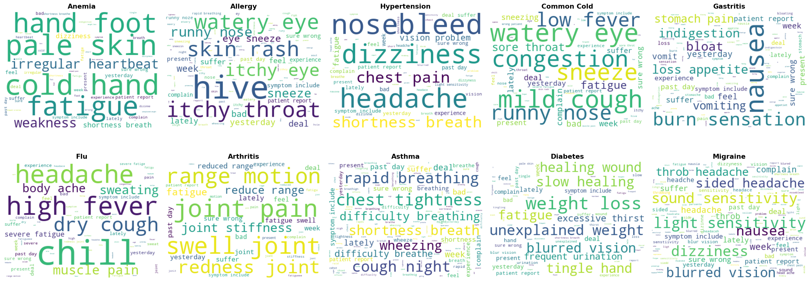
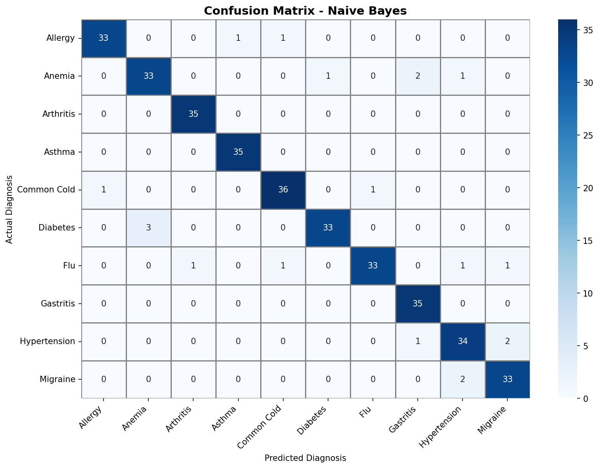
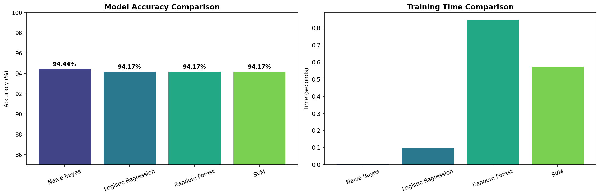
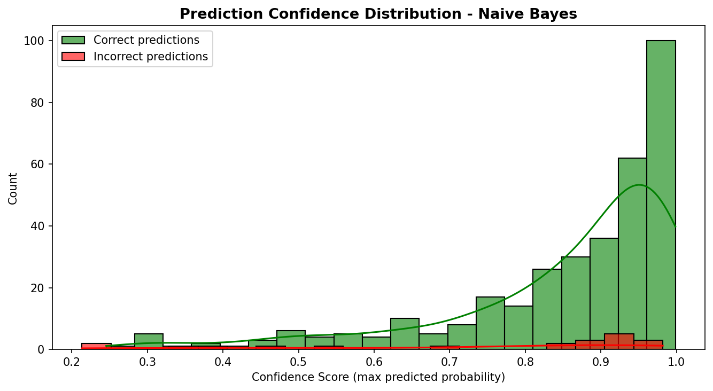
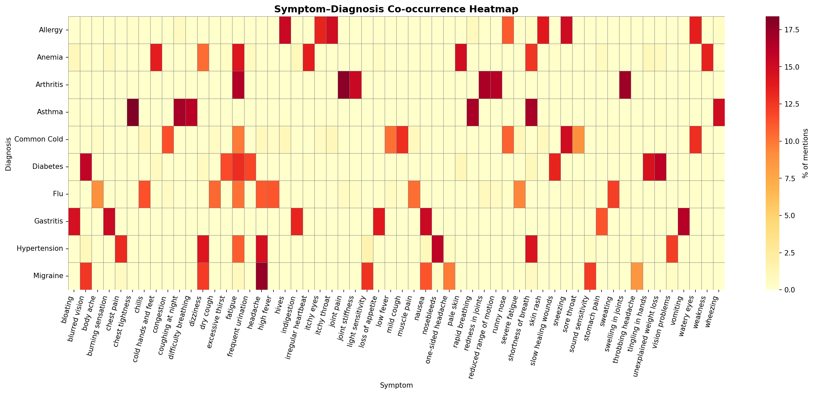
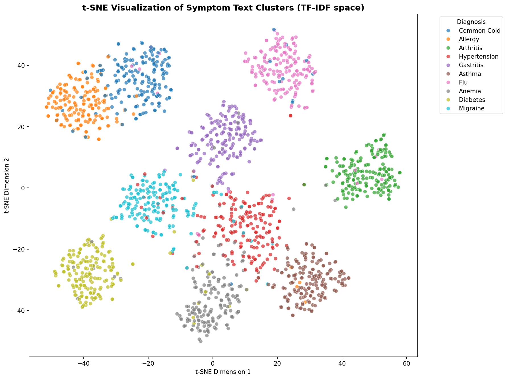

# Symptom-to-Diagnosis NLP Classifier

An NLP-based text classification system that predicts likely medical diagnoses from free-text symptom descriptions, using TF-IDF vectorization and classical machine learning models.

## Overview

This project simulates a real-world clinical text classification problem: given a patient's free-text description of symptoms, predict the most likely diagnosis among 10 common conditions. The dataset is synthetically generated with realistic noise (typos, overlapping symptoms, and ~4% deliberate label ambiguity between commonly confused conditions) to avoid unrealistically clean results.

## Dataset

- ~1,800 synthetic patient notes across 10 diagnosis categories: Common Cold, Flu, Migraine, Diabetes, Hypertension, Allergy, Asthma, Gastritis, Anemia, and Arthritis
- Generated using symptom-vocabulary templates with sentence-structure variation
- Realistic noise injected: character-level typos and ~4% label noise between confusable diagnosis pairs (e.g., Common Cold ↔ Flu, Migraine ↔ Hypertension)

## Tech Stack

- **Language**: Python
- **NLP**: spaCy (tokenization, lemmatization, stopword removal)
- **Feature Engineering**: scikit-learn TF-IDF Vectorizer (unigrams + bigrams)
- **Models**: Logistic Regression, Naive Bayes, Random Forest, SVM
- **Visualization**: Matplotlib, Seaborn, WordCloud
- **Dimensionality Reduction**: t-SNE

## Methodology

1. Synthetic dataset generation with template-based sentence construction
2. Noise injection (typos + label ambiguity) for realistic evaluation
3. Text preprocessing with spaCy (lemmatization, stopword removal)
4. TF-IDF vectorization (max 2000 features, 1-2 grams)
5. Training and comparison of 4 classification models
6. Model evaluation via confusion matrix, classification report, and confidence distribution analysis
7. Exploratory visualizations: word clouds, symptom-diagnosis co-occurrence heatmap, t-SNE clustering

## Results

| Model | Accuracy | Train Time |
|---|---|---|
| Naive Bayes | 94.44% | 0.01s |
| Logistic Regression | 94.17% | 0.16s |
| Random Forest | 94.17% | 1.53s |
| SVM | 94.17% | 0.82s |

Naive Bayes achieved the highest accuracy while training the fastest, consistent with its known strength on text classification tasks. Misclassifications were concentrated among symptomatically overlapping diagnosis pairs, confirming the model learned genuine symptom patterns rather than memorizing noise.

## Visualizations

**Word Clouds by Diagnosis**

**Confusion Matrix (Best Model)**

**Model Comparison (Accuracy & Training Time)**

**Prediction Confidence Distribution**

**Symptom-Diagnosis Co-occurrence Heatmap**

**t-SNE Cluster Visualization**

## How to Run

1. Clone this repository
2. Install dependencies:
3. Open `symptom_diagnosis_nlp.ipynb` in Jupyter Notebook or VS Code
4. Run all cells sequentially
5. Use the `predict_diagnosis("your symptom text here")` function at the end of the notebook to test custom symptom inputs

## Conclusion

This project implements a symptom-to-diagnosis NLP classifier that predicts likely medical conditions from free-text symptom descriptions. Four classical ML models were trained and compared on TF-IDF features derived from a synthetic, intentionally noisy dataset of ~1,800 patient notes across 10 diagnosis categories. All models achieved 94-94.4% accuracy, with Naive Bayes performing marginally best while training the fastest. Confusion matrix analysis confirmed that most misclassifications occurred between symptomatically overlapping conditions (e.g., Common Cold vs. Flu, Migraine vs. Hypertension), validating that the model learned genuine symptom patterns rather than memorizing dataset noise. A notebook-based prediction function (`predict_diagnosis()`) enables live testing with custom symptom text, returning both a predicted diagnosis and a confidence breakdown across the top likely conditions.

## Limitations

- Dataset is synthetically generated and does not capture the full complexity of real clinical records
- Intended strictly for educational and portfolio purposes — not a substitute for professional medical diagnosis

## Future Improvements

- Incorporate real (anonymized) clinical text datasets
- Experiment with transformer-based embeddings (BioBERT, ClinicalBERT)
- Extend to multi-label classification for co-occurring conditions
- Deploy as a web application (Streamlit/Flask)

---
*This project is part of a data science portfolio focused on NLP and machine learning applications.*

## Author

**Shibila Sherin M**

Data Science | Data Analysis | Power BI | Python |Statistics | Machine Learning | NLP | Deep Learning | SQL

